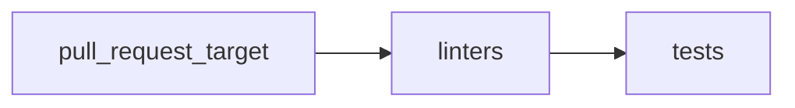

The pull Request Workflow, defined in the `pullrequest.yml` file, is triggered on `pull_request_target` events to the branches `master` and `main`. It has three jobs: **linters**, **build**, **tests**, and **report_results**.



### Linters

This job performs the following steps:

1. Checks out the code
1. Installs pre-commit.
1. Runs pre-commit hooks to execute code linting based on `.pre-commit-config.yaml` file

#### Running local pre-commit

!!! info
    Main purpose for pre-commit is to allow developers to pass the Lint Checks before commiting the code. Same checks will be executed on all the commits once they are pushed to GitHub

---

To install pre-commit checks locally, follow these steps:

1. Install [pre-commit](https://pre-commit.com/) by running the following command:

    ```console
    pip install pre-commit
    ```

1. `ruby` is required for running the Markdown Linter, installation will depends on your Operating System, for example, on Fedora:

    ```console
    dnf install -y ruby
    ```

1. Initialize pre-commit on the repo:

    ```console
    pre-commit install
    ```

---

To run pre-commit manually for all files, you can use:

```console
$ pre-commit run --all-files
markdownlint.............................................................Passed
Test shell scripts with shellcheck.......................................Passed
check json...............................................................Passed
flake8...................................................................Passed
pylint...................................................................Passed
```

Or you can run against an especific file:

```console
$ pre-commit run --files docs/index.md
markdownlint.............................................................Passed
Test shell scripts with shellcheck...................(no files to check)Skipped
check json...........................................(no files to check)Skipped
flake8...............................................(no files to check)Skipped
pylint...............................................(no files to check)Skipped
```

Pre-commit hooks can be updated using `pre-commit autoupdate`:

```console
$ pre-commit autoupdate
[https://github.com/igorshubovych/markdownlint-cli] already up to date!
[https://github.com/jumanjihouse/pre-commit-hooks] already up to date!
[https://github.com/pre-commit/pre-commit-hooks] already up to date!
[https://github.com/PyCQA/flake8] already up to date!
[https://github.com/PyCQA/pylint] already up to date!
```

### Tests


