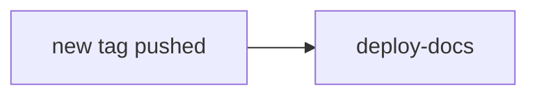

The Release workflow, defined in the `release.yml` file, when a new tag is pushed it triggers: **release-build** and **image-upload**.

The `deploy-docs` job is triggered when a new release is `published`, this is done by the `release_build` job.

### Docs Update

Uses the `Deploy docs` workflow defined in the `docs.yml` file to generate and deploy the documentation performing the following steps:

1. Checks out the code.
1. Sets up Python 3.x.
1. Exports the release tag version as an environment variable.
1. Sets up the Git configuration for documentation deployment.
1. Installs the required dependencies, including mkdocs-material and mike.
1. Deploys the documentation using the mike deploy command, with specific parameters for updating aliases and including the release tag version in the deployment message.
